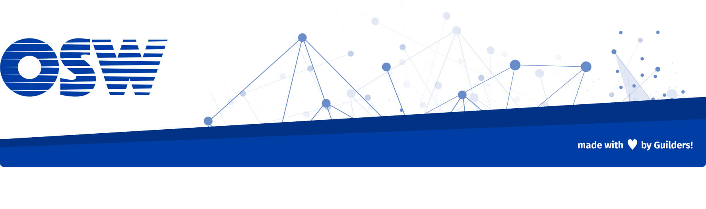

# Aprendiendo Rust: grup, un grep a lo rust

grup es un proyecto, educativo, que reimplementa [grep](https://es.wikipedia.org/wiki/Grep) en Rust.

Los objetivos de este proyecto son:

1. Aprender [Rust](https://www.rust-lang.org/).
1. Aprender y utilizar herramientas de [GitHub](https://github.com/).
1. Aprender y utilizar metodologías de [desarrollo ágil de software](http://agilemanifesto.org/).

## Instalación

Por definir.

## Uso

Por definir.

## Contribuir

Revisa [la guía de contribuidores](./docs/CONTRIBUTING.md).

## Créditos

Por definir.

## Licencia

Revisa [la licencia](./LICENSE).

